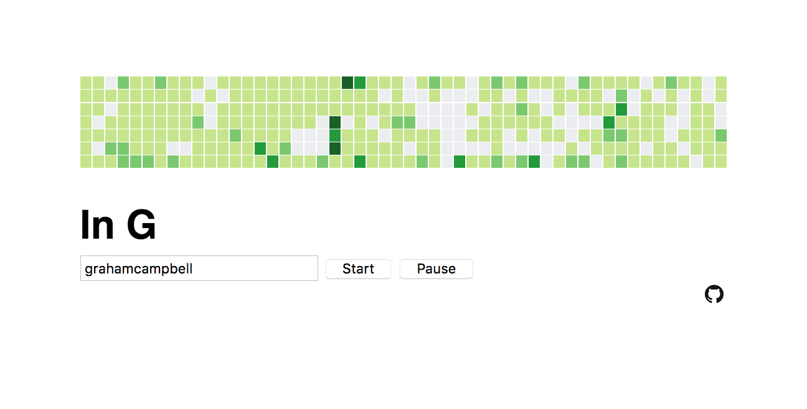

# In G
GitHub user contribution graphs as pentatonic chords in the key of G. https://in-g.herokuapp.com/



One of my favorite ‘albums’ for getting in the zone is Terry Riley’s [_In C_](https://en.wikipedia.org/wiki/In_C). It’s one of the earliest and best known pieces of minimal music. Over the holidays I was stranded in the Jacksonville airport due to weather-related flight delays. I hacked most of this together in the airport bar. Here’s a brief run-down of the app. I recommend [listening to the inspiration while reading this tutorial...](https://youtu.be/XRaa34E8tXQ)

GitHub user contribution graphs look a lot like digital audio sequencers, so why not play them like music? There are five hex values associated with GitHub contribution graphs, so I based the audio on a pentatonic scale in the key of G. (GABDE, or do re mi so la). Each day of the week is an octave, with Sunday the highest pitch and Saturday the lowest.

GitHub has a well-documented API, but I could not find a straightforward means of getting a user’s contribution graph using it.

Let’s scrape it!

## Server Side

For the purposes of this tutorial I am going to assume you have an understanding of Node do not have either experience with web scraping or web audio. If you are new to Node, you can download and install it here https://nodejs.org/en/ There are countless tutorials to get you started.

Using our browser’s Inspect tools, we can see that a GitHub user graph is rendered in an `<svg>` element containing nested `<g>` elements containing `<rect>` elements. Notice there are seven `<rect>` elements and each has a corresponding `data-date` attribute. This is each week rendered as rectangles in a column, beginning with Sunday and ending with Saturday. What we want to scrape is the `fill` attribute associated with each `<rect>`.

Make a new directory and change into it.
```
mkdir in-g
cd in-g
```

Let’s first set up a simple scraper. We need two npm packages to do so, `cheerio` and `request`.
```
npm install cheerio request
```

Next create a `server.js` file and add our dependencies.
```js
var cheerio = require("cheerio");
var request = require("request");
```

We use request for HTTP requests and cheerio for server-side HTML element selection, a la jQuery.

Let’s first make a request to GitHub.
```js
request("https://github.com/nielsenjared", function(error, response, html) {
  console.log(html);
});
```

Then, if you’re new to this, from the command line, run:
```
node server.js
```

You should get a response of all the HTML associated with the page you scraped.

Now let’s use cheerio to pick out the elements we want. Because cheerio is like jQuery on the backend, the convention is to load the HTML you are working with into a `$`, like so:
```js
var $ = cheerio.load(html);
```

The [cheerio docs](https://cheerio.js.org/) are pretty good. There are a lot of methods we can use to work with our request response. Let’s start with something simple.
```js
console.log($("h1").text());
```

Your output should be something like:
```
Jared Nielsen
nielsenjared
```

Cool. Now let’s burrow down into the graph. Our goal is to scrape the fill attribute associated with each `<rect>` element. Try this: change the “h1” to “rect” and .text() to .attr():
```js
console.log($("rect").attr());
```

You should get something similar to this:
```js
{ class: 'day',
  width: '10',
  height: '10',
  x: '13',
  y: '0',
  fill: '#ebedf0',
  'data-count': '0',
  'data-date': '2017-02-19' }
```

For me, at the time of this writing, this is the first rectangle in my graph. That’s great. We got one rect. But what we want is all 365 or so of them. Because we loaded Cheerio into the $ selector, we have access to all of its built-in methods. We want to use [.each()] (https://github.com/cheeriojs/cheerio#each-functionindex-element-)

If we read the fantastic manual, we find this example:
```js
const fruits = [];

$('li').each(function(i, elem) {
  fruits[i] = $(this).text();
});

fruits.join(', ');
//=> Apple, Orange, Pear
```

Modify your app like so:
```js
$('rect').each(function(i, elem){
    console.log($(this).attr());
  });
```

Then run it again. The output in your console should be considerably longer than before.

_this_ can be a confusing concept for beginners. In this example, it’s roughly equivalent to this:
```js
$('rect').each(function(i, elem){
    console.log($(elem).attr());
  });
```

So now we’re scraping a year’s worth of rectangle attributes. We still only want the fill, though. Easy. Just pass the `.attr` method the specific property you want to scrape:
```js
$('rect').each(function(i, elem){
    console.log($(elem).attr('fill'));
  });
```

Now we need to do something with this data. If our goal is to play each week as a “chord” then we want our dataset to reflect the weekly structure of the graph. There are a number of ways we could approach this. We saw in the documentation above the declaration of a fruits array to which each `<li>` element was being added by index. We could take that approach and then slice the array into subarrays for every seven items. Or we could scrape the data directly into an object.

If you recall, our HTML element architecture looks like this:
```html
<svg>
    <g>
        <g>
            <rect>
        </g>
        <g>
            <rect>
        </g>
        … etc.
    </g>
    <g>
    … etc.
</svg>
```

We can chain the [.children() method](https://github.com/cheeriojs/cheerio#childrenselector) and the [.eq() method](https://github.com/cheeriojs/cheerio#eq-i-) to get the attributes of the `<rect>` elements nested in the `<g>` elements and add these by week into an object, like so:
```js
var url = "https://github.com/nielsenjared";

request(url, function(error, response, html) {

    var $ = cheerio.load(html);
    var data = {};

$("g g").each(function(i, element) {

      data['w' + i] = [
        $(element).children().eq(0).attr("fill"),
        $(element).children().eq(1).attr("fill"),
        $(element).children().eq(2).attr("fill"),
        $(element).children().eq(3).attr("fill"),
        $(element).children().eq(4).attr("fill"),
        $(element).children().eq(5).attr("fill"),
        $(element).children().eq(6).attr("fill")
      ]
    });
    console.log(data);
  })
```

Here we are scraping the children of every nested `<g>` where the index is equal to a specific value. We can further refactor this like so:
```js
$("g g").each(function(i, element) {
      data['w' + i] = [];
      for (var j = 0; j < $(element).children().length; j++){
        data['w' + i].push($(element).children().eq(j).attr("fill"));
      }
});
```

We are now scraping a given GitHub user graph into an object with properties holding the hex values of a week’s activity.

The next step with server.js is to wrap our scrape in an Express `.get()` request and return JSON.

```js
var cheerio = require("cheerio");
var request = require("request");
var express = require("express");
var path = require("path");

var app = express();
var PORT = process.env.PORT || 3000;

app.use(express.static('public'));

app.get("/", function(req, res) {
  res.sendFile(path.join(__dirname, "index.html"));
});

app.get("/scrape/:username", function(req, res) {
  var username = req.params.username;

  var url = "https://github.com/" + username;

  request(url, function(error, response, html) {
    var data = {};
    // var $ = cheerio.load(html);
    try {
      var $ = cheerio.load(html)
    } catch (e) {
      console.log("cheerio err"); // TODO handle error
    }

    $("g g").each(function(i, element) {
      data['w' + i] = [];
      for (var j = 0; j < $(element).children().length; j++){
        data['w' + i].push($(element).children().eq(j).attr("fill"));
      }
    });
    return res.json(data);
  })

});//end app.get("/scrape")

app.listen(PORT, function() {
  console.log("App listening on PORT " + PORT);
});

```

Navigate to [localhost](http://localhost:3000/scrape/nielsenjared) and verify that your scraper works and is returning JSON to the client.

Kill the server as we won't need it while we play with Tone.js.


## Client Side

To use Tone.js client-side, you will need to download and add the library to your app: https://github.com/Tonejs/Tone.js#installation

Download and add [this file](https://tonejs.github.io/build/Tone.min.js) to your project directory.

Create an `index.html` file with boilerplate HTML and add Tone.js to the `<head>`.

```HTML
<script src="./Tone.min.js"></script>
```

If we [RTFM](https://tonejs.github.io/), we see how easy it is to play a tone. Add the following to the `<body>` of your index.html and open it in your browser:
```js
<script>
//create a synth and connect it to the master output (your speakers)
  var synth = new Tone.Synth().toMaster()

  //play a middle 'C' for the duration of an 8th note
  synth.triggerAttackRelease('C4', '8n')
</script>
```

But if we want to play several notes, or tones, at once, we need to use [Polysynth](https://tonejs.github.io/docs/r11/PolySynth). Again, the fantastic manual provides us with an example:
```js
//a polysynth composed of 6 Voices of Synth
var synth = new Tone.PolySynth(6, Tone.Synth).toMaster();
//set the attributes using the set interface
synth.set("detune", -1200);
//play a chord
synth.triggerAttackRelease(["C4", "E4", "A4"], "4n");
```

As we can see, rather than a single note, triggerAttackRelease takes an array of notes, which it plays as a chord. The appended numeral 4 designates the octave. Recall that we are planning to play a pentatonic chord in the key of G (GABDE, or do re mi so la). Let's build a test chord now.

```js
//a polysynth composed of 6 Voices of Synth
var synth = new Tone.PolySynth(7, Tone.Synth).toMaster();
//set the attributes using the set interface
synth.set("detune", -1200);
//play a chord
synth.triggerAttackRelease(["G6", "A6", "B6", "D6", "E6"], "4n");
```

We can also pass that as a variable
```js
var chord = ["G6", "A6", "B6", "D6", "E6"]
var synth = new Tone.PolySynth(7, Tone.Synth).toMaster();
synth.set("detune", -1200);
synth.triggerAttackRelease(chord, "4n");
```

In order to play multiple chords, we need to use [Tone.Part](https://tonejs.github.io/docs/r11/Part). The manual gives us this code snippet...
```js
var part = new Tone.Part(function(time, note){
	//the notes given as the second element in the array
	//will be passed in as the second argument
	synth.triggerAttackRelease(note, "8n", time);
}, [[0, "C2"], ["0:2", "C3"], ["0:3:2", "G2"]]);
```

... but this is where it is less than fantastic. If we drop the above code into our index.html, we won't get anything in return. If we take a look at the [PolySynth example](https://tonejs.github.io/examples/#polySynth) we see Tone.PolySynth in action. Fun! But if we look at the [source](https://github.com/Tonejs/Tone.js/blob/master/examples/polySynth.html), there's a lot of additional configuration to do that obfuscates the functionality. So... let's check out [the next example](https://tonejs.github.io/examples/#jump). [Jump!](https://github.com/Tonejs/Tone.js/blob/master/examples/jump.html)

```js
var synth = new Tone.PolySynth(3, Tone.Synth, {
			"oscillator" : {
				"type" : "fatsawtooth",
				"count" : 3,
				"spread" : 30
			},
			"envelope": {
				"attack": 0.01,
				"decay": 0.1,
				"sustain": 0.5,
				"release": 0.4,
				"attackCurve" : "exponential"
			},
		}).toMaster();

    var part = new Tone.Part(function(time, note){
			synth.triggerAttackRelease(note.noteName, note.duration, time, note.velocity);
		}, [
			{
				"time": "192i",
				"noteName": "G4",
				"velocity": 0.8110236220472441,
				"duration": "104i"
			},
			{
				"time": "192i",
				"noteName": "B4",
				"velocity": 0.7874015748031497,
				"duration": "104i"
			},
			{
				"time": "192i",
				"noteName": "D5",
				"velocity": 0.8031496062992126,
				"duration": "104i"
			},
			{
				"time": "480i",
				"noteName": "G4",
				"velocity": 0.7559055118110236,
				"duration": "104i"
			},
			{
				"time": "480i",
				"noteName": "C5",
				"velocity": 0.6850393700787402,
				"duration": "104i"
			},
			{
				"time": "480i",
				"noteName": "E5",
				"velocity": 0.6771653543307087,
				"duration": "104i"
			},
			{
				"time": "768i",
				"noteName": "F4",
				"velocity": 0.8661417322834646,
				"duration": "104i"
			},
			{
				"time": "768i",
				"noteName": "A4",
				"velocity": 0.8346456692913385,
				"duration": "104i"
			},
			{
				"time": "768i",
				"noteName": "C5",
				"velocity": 0.8188976377952756,
				"duration": "104i"
			},
			{
				"time": "1056i",
				"noteName": "F4",
				"velocity": 0.7007874015748031,
				"duration": "104i"
			},
			{
				"time": "1056i",
				"noteName": "A4",
				"velocity": 0.6850393700787402,
				"duration": "104i"
			},
			{
				"time": "1056i",
				"noteName": "C5",
				"velocity": 0.6614173228346457,
				"duration": "104i"
			},
			{
				"time": "1248i",
				"noteName": "G4",
				"velocity": 0.6771653543307087,
				"duration": "104i"
			},
			{
				"time": "1248i",
				"noteName": "B4",
				"velocity": 0.6771653543307087,
				"duration": "104i"
			},
			{
				"time": "1248i",
				"noteName": "D5",
				"velocity": 0.7165354330708661,
				"duration": "104i"
			},
			{
				"time": "1440i",
				"noteName": "G4",
				"velocity": 0.8818897637795275,
				"duration": "248i"
			},
			{
				"time": "1440i",
				"noteName": "B4",
				"velocity": 0.84251968503937,
				"duration": "248i"
			},
			{
				"time": "1440i",
				"noteName": "D5",
				"velocity": 0.8818897637795275,
				"duration": "248i"
			},
			{
				"time": "1728i",
				"noteName": "G4",
				"velocity": 0.8267716535433071,
				"duration": "104i"
			},
			{
				"time": "1728i",
				"noteName": "C5",
				"velocity": 0.8031496062992126,
				"duration": "104i"
			},
			{
				"time": "1728i",
				"noteName": "E5",
				"velocity": 0.8188976377952756,
				"duration": "104i"
			},
			{
				"time": "2016i",
				"noteName": "F4",
				"velocity": 0.7086614173228346,
				"duration": "104i"
			},
			{
				"time": "2016i",
				"noteName": "A4",
				"velocity": 0.7244094488188977,
				"duration": "104i"
			},
			{
				"time": "2016i",
				"noteName": "C5",
				"velocity": 0.7007874015748031,
				"duration": "104i"
			},
			{
				"time": "2208i",
				"noteName": "C4",
				"velocity": 0.9921259842519685,
				"duration": "296i"
			},
			{
				"time": "2208i",
				"noteName": "F4",
				"velocity": 0.968503937007874,
				"duration": "200i"
			},
			{
				"time": "2208i",
				"noteName": "A4",
				"velocity": 0.9606299212598425,
				"duration": "208i"
			},
			{
				"time": "2400i",
				"noteName": "E4",
				"velocity": 0.7559055118110236,
				"duration": "104i"
			},
			{
				"time": "2400i",
				"noteName": "G4",
				"velocity": 0.7007874015748031,
				"duration": "104i"
			},
			{
				"time": "2592i",
				"noteName": "C4",
				"velocity": 0.968503937007874,
				"duration": "488i"
			},
			{
				"time": "2592i",
				"noteName": "D4",
				"velocity": 0.9448818897637795,
				"duration": "488i"
			},
			{
				"time": "2592i",
				"noteName": "G4",
				"velocity": 0.937007874015748,
				"duration": "488i"
			}
	]).start(0);
	part.loop = true;
	part.loopEnd = "4m";
	Tone.Transport.bpm.value = 132;

  //pulled this out of the Interface.Button to autoplay on page load
  Tone.Transport.start("+0.1");
	```

  From this example we see that we initialize a new Tone.PolySynth `synth` and then initialize `part` as a new Tone.Part. Within Tone.Part we invoke `synth.triggerAttackRelease` and pass `part` an array of objects containing the _Jump_ chord progression. Let's simplify this so we can see what's happening:
```js
var chords = [
  {
    "time": "192i",
    "noteName": "G4",
    "velocity": 0.8110236220472441,
    "duration": "104i"
  },
  {
    "time": "192i",
    "noteName": "B4",
    "velocity": 0.7874015748031497,
    "duration": "104i"
  },
  {
    "time": "192i",
    "noteName": "D5",
    "velocity": 0.8031496062992126,
    "duration": "104i"
  },
  {
    "time": "480i",
    "noteName": "G4",
    "velocity": 0.7559055118110236,
    "duration": "104i"
  },
  {
    "time": "480i",
    "noteName": "C5",
    "velocity": 0.6850393700787402,
    "duration": "104i"
  },
  {
    "time": "480i",
    "noteName": "E5",
    "velocity": 0.6771653543307087,
    "duration": "104i"
  },
  {
    "time": "768i",
    "noteName": "F4",
    "velocity": 0.8661417322834646,
    "duration": "104i"
  },
  {
    "time": "768i",
    "noteName": "A4",
    "velocity": 0.8346456692913385,
    "duration": "104i"
  },
  {
    "time": "768i",
    "noteName": "C5",
    "velocity": 0.8188976377952756,
    "duration": "104i"
  },
  {
    "time": "1056i",
    "noteName": "F4",
    "velocity": 0.7007874015748031,
    "duration": "104i"
  },
  {
    "time": "1056i",
    "noteName": "A4",
    "velocity": 0.6850393700787402,
    "duration": "104i"
  },
  {
    "time": "1056i",
    "noteName": "C5",
    "velocity": 0.6614173228346457,
    "duration": "104i"
  },
  {
    "time": "1248i",
    "noteName": "G4",
    "velocity": 0.6771653543307087,
    "duration": "104i"
  },
  {
    "time": "1248i",
    "noteName": "B4",
    "velocity": 0.6771653543307087,
    "duration": "104i"
  },
  {
    "time": "1248i",
    "noteName": "D5",
    "velocity": 0.7165354330708661,
    "duration": "104i"
  },
  {
    "time": "1440i",
    "noteName": "G4",
    "velocity": 0.8818897637795275,
    "duration": "248i"
  },
  {
    "time": "1440i",
    "noteName": "B4",
    "velocity": 0.84251968503937,
    "duration": "248i"
  },
  {
    "time": "1440i",
    "noteName": "D5",
    "velocity": 0.8818897637795275,
    "duration": "248i"
  },
  {
    "time": "1728i",
    "noteName": "G4",
    "velocity": 0.8267716535433071,
    "duration": "104i"
  },
  {
    "time": "1728i",
    "noteName": "C5",
    "velocity": 0.8031496062992126,
    "duration": "104i"
  },
  {
    "time": "1728i",
    "noteName": "E5",
    "velocity": 0.8188976377952756,
    "duration": "104i"
  },
  {
    "time": "2016i",
    "noteName": "F4",
    "velocity": 0.7086614173228346,
    "duration": "104i"
  },
  {
    "time": "2016i",
    "noteName": "A4",
    "velocity": 0.7244094488188977,
    "duration": "104i"
  },
  {
    "time": "2016i",
    "noteName": "C5",
    "velocity": 0.7007874015748031,
    "duration": "104i"
  },
  {
    "time": "2208i",
    "noteName": "C4",
    "velocity": 0.9921259842519685,
    "duration": "296i"
  },
  {
    "time": "2208i",
    "noteName": "F4",
    "velocity": 0.968503937007874,
    "duration": "200i"
  },
  {
    "time": "2208i",
    "noteName": "A4",
    "velocity": 0.9606299212598425,
    "duration": "208i"
  },
  {
    "time": "2400i",
    "noteName": "E4",
    "velocity": 0.7559055118110236,
    "duration": "104i"
  },
  {
    "time": "2400i",
    "noteName": "G4",
    "velocity": 0.7007874015748031,
    "duration": "104i"
    },
    {
      "time": "2592i",
      "noteName": "C4",
      "velocity": 0.968503937007874,
      "duration": "488i"
    },
    {
      "time": "2592i",
      "noteName": "D4",
      "velocity": 0.9448818897637795,
      "duration": "488i"
    },
    {
      "time": "2592i",
      "noteName": "G4",
      "velocity": 0.937007874015748,
      "duration": "488i"
    }
];

var synth = new Tone.PolySynth(3, Tone.Synth, {
      "oscillator" : {
        "type" : "fatsawtooth",
        "count" : 3,
        "spread" : 30
      },
      "envelope": {
        "attack": 0.01,
        "decay": 0.1,
        "sustain": 0.5,
        "release": 0.4,
        "attackCurve" : "exponential"
      },
    }).toMaster();

    var part = new Tone.Part(function(time, note){
      synth.triggerAttackRelease(note.noteName, note.duration, time, note.velocity);
    }, chords).start(0);

    part.loop = true;
    part.loopEnd = "4m";
    Tone.Transport.bpm.value = 132;

    //
    Tone.Transport.start("+0.1");
```

I moved our chords into a variable `chords` and then passed it to Tone.Part as its second argument, after the callback. If we [refer back to the docs](https://tonejs.github.io/docs/r11/Part) we see that basic usage looks like this:
`new Tone.Part ( callback , events )`

Where the callback is what we want to invoke on each event and each event is passed in as an element in an array. If you're new to Node or still find callbacks confusing, we can further refactor the Jump example by declaring the callback as a named function.

```js
function callback(time, note){
  synth.triggerAttackRelease(note.noteName, note.duration, time, note.velocity);
}

var part = new Tone.Part(callback, chords).start(0);
```

Let's simplify this further and look at how to pass an array of arrays rather than an object. Referring back to the docs, we have this example:
```js
var part = new Tone.Part(function(time, note){
	//the notes given as the second element in the array
	//will be passed in as the second argument
	synth.triggerAttackRelease(note, "8n", time);
}, [[0, "C2"], ["0:2", "C3"], ["0:3:2", "G2"]]);
```

Let's replace our `chords` variable with the array we see above
```js
var chords = [[0, "C2"], ["0:2", "C3"], ["0:3:2", "G2"]];
```

Then modify our callback, removing the references to object properties:
```js
function callback(time, note){
  synth.triggerAttackRelease(note, "8n", time);
}
```

## Front && Back
Now all we need to do is connect the backend scraper to the front-end. We need our server running to do so, so fire it up:
`nodemon server.js`

Here's some starter HTML and jQuery to expedite the process (note that you will need to create a `public` directory and move the Tone file into it so Express can serve static files):
```HTML
<!DOCTYPE html>
<html>
  <head>
    <meta charset="utf-8">
    <title></title>
    <script src="./Tone.min.js"></script>
  </head>
  <body>
    <div id="container">
      <form id="github-user-form">
        <input type="text" id="github-username" placeholder="Enter GitHub username" size="25">
        <input id="start-button" type="submit" value="Start">
      </form>
      <div id="contribution-graph"></div>
    </div>
    <script src="https://code.jquery.com/jquery-1.11.1.js"></script>
    <script>
    $("#start-button").on("click", function(event) {
      var username = $("#github-username").val().trim();
      event.preventDefault();
      $.get('/scrape/' + username, function(data){
        console.log(data);
      });
    });
    </script>
  </body>
</html>
```

Enter a GitHub username in the input field and hit submit. Using your dev inspector tools, you should see an object in the console containing all of our scraped user data.

Let's do something with that data.

Declare a global variable, `chords` and assign it an empty array.

If we recall, Tone.Part expects to receive an array of arrays. Let's build that in our GET request to '/scrape':
```js
var chords = [];

$("#start-button").on("click", function(event) {
  var username = $("#github-username").val().trim();
  event.preventDefault();
  $.get('/scrape/' + username, function(data){
    var time = 0;
    for (key in data) {
      var chord = [];
      chord.push(time + "i");
      time+=10;
      var notes = [];
      for (var i = 1; i <= data[key].length; i++){
        if (data[key][i-1] === "#196127") {
          notes.push(data[key][i-1] = "E" + i);
        }
        else if (data[key][i-1] === "#239a3b") {
          notes.push(data[key][i-1] = "D" + i);
        }
        else if (data[key][i-1] === "#7bc96f") {
          notes.push(data[key][i-1] = "B" + i);
        }
        else if (data[key][i-1] === "#c6e48b") {
          notes.push(data[key][i-1] = "A" + i);
        }
        else {
          notes.push(data[key][i-1] = "G" + i);
        }
      }
      chord.push(notes);
      chords.push(chord);
    }
  });
  console.log(chords);
});
```

Add a console.log() inside the jQuery on "click" listener so we can see if our array is being built correctly.

No errors? Cool beans.

Let's add our synth.

```js
var synth = new Tone.PolySynth(7, Tone.Synth, {
    "volume" : -8,
    "oscillator" : {
      "partials" : [1, 2, 1],
    },
    "portamento" : 0.05
  }).toMaster()
```

And our Part...
```js
var synthPart = new Tone.Part(function(time, chord){
      synth.triggerAttackRelease(chord, '16n', time);

    }, chords).start("0");

    synthPart.loop = false;
    synthPart.humanize = false;

    Tone.Transport.bpm.value = 10;
    Tone.Transport.start("+0.1");
```

Now we need to add a new Tone.js class, [Tone.Draw](https://tonejs.github.io/docs/r11/Draw). This will allow us to sync visual events with audio events.

Inside `synthPart`, add the following:
```js
synthPart = new Tone.Part(function(time, chord){
      synth.triggerAttackRelease(chord, '16n', time);

      Tone.Draw.schedule(function(){
        $('#contribution-graph').text(chord);

      }, time);
    }, chords).start("0");
```

Your app should be rendering each chord as it is played in real time in the contribution-graph div.

The last piece is to add some style. In the `public` directory, create a new stylesheet, `style.css` and link it to index.html in the `<head>`:
```html
<link rel="stylesheet" type="text/css" href="./style.css">
```
Add to style.css the following:
```css
.G1, .G2, .G3, .G4, .G5, .G6, .G7 {
  background-color: #ebedf0;
	height: 10px;
	margin: 6%;
}

.A1, .A2, .A3, .A4, .A5, .A6, .A7 {
  background-color: #c6e48b;
	height: 10px;
	margin: 6%;
}

.B1, .B2, .B3, .B4, .B5, .B6, .B7 {
  background-color: #7bc96f;
	height: 10px;
	margin: 6%;
}

.D1, .D2, .D3, .D4, .D5, .D6, .D7 {
  background-color: #239a3b;
	height: 10px;
	margin: 6%;
}

.E1, .E2, .E3, .E4, .E5, .E6, .E7 {
  background-color: #196127;
	height: 10px;
	margin: 6%;
}

.week {
	position: relative;
	float: left;
	width: 10px;
	/*width: 1.75%;*/
}
```

Lastly, inside Tone.Draw, add the following:

```js
var sun = $("<div>&nbsp;</div>").attr("class", chord[0]);
    var mon = $("<div>&nbsp;</div>").attr("class", chord[1]);
    var tue = $("<div>&nbsp;</div>").attr("class", chord[2]);
    var wed = $("<div>&nbsp;</div>").attr("class", chord[3]);
    var thu = $("<div>&nbsp;</div>").attr("class", chord[4]);
    var fri = $("<div>&nbsp;</div>").attr("class", chord[5]);
    var sat = $("<div>&nbsp;</div>").attr("class", chord[6]);

    var week = $("<div>").addClass("animated pulse week").append(sun, mon, tue, wed, thu, fri, sat);
    $("#contribution-graph").append(week);
```

Music to my ears and eyes! I leave it to you to refer to the [code base](https://github.com/nielsenjared/in-g) to add the final touches. Happy sonification!

## License
GNU GPLv3
